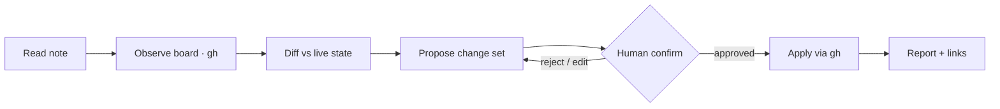

# Project Management with an AI Agent

An AI agent that turns **meeting notes into project management actions** on a live
**[GitHub Projects](https://github.com/orgs/KIBA-Automation/projects/1)** board —
with a human in the loop on every change.

You drop a plain‑text meeting transcript into a local folder. The agent reads it,
compares what was discussed against the *current* state of the board (via the
[`gh`](https://cli.github.com/) CLI), and proposes a concrete set of updates: status
changes, priority changes, new items, comments, and so on. **Nothing is written to
the board until you confirm it.**

> This repo is also the **control hub** for the [`KIBA-Automation`](https://github.com/KIBA-Automation)
> org. It was originally built against self‑hosted Plane and migrated to GitHub
> Projects in June 2026 — see [`docs/migration.md`](docs/migration.md).

---

## The KIBA-Automation org at a glance

| Repo | What it is |
|------|------------|
| **project_management_with_ai_agent** (this) | Control hub: meeting pipeline, reconcile scripts, agent manual |
| [**quali-fit**](https://github.com/KIBA-Automation/quali-fit) | Certificate‑based staff recommendation system (the main product) |
| **KIBA_Meeting_Transcript** (private) | Raw meeting transcripts, staged before reconciliation |
| Board → [**KIBA Automation / Project #1**](https://github.com/orgs/KIBA-Automation/projects/1) | The work tracker (replaces Plane) |

All KIBA repos carry the `kiba` topic. The archived
[`plane-cli-for-ai-agents`](https://github.com/bookseal/plane-cli-for-ai-agents)
records the earlier Plane exploration.

---

## Why this exists

Meetings produce decisions; project trackers drift out of date. The gap between
"what we agreed in the room" and "what the board says" is where work gets lost.
This project closes that gap by treating the meeting note as the source of intent
and the GitHub Project as the source of record — and using an agent to reconcile
the two, under human supervision.

---

## What this demonstrates

This repo doubles as a **portfolio** of how its author operates as a
lead / forward-deployed engineer: turning messy real-world input (meeting talk) into
**tracked, accountable work that an AI agent can safely help drive**. The artifacts
matter more than the line count — they show *judgment*, not just code:

- **Agent design with guardrails** — a human-in-the-loop contract where the agent
  *proposes* but never writes without approval. → [`CLAUDE.md`](CLAUDE.md)
- **Judgment, recorded** — a [**Decision Log** (ADRs)](docs/decisions/) capturing *why*
  each major choice was made (leaving self-hosted Plane, the work model, the safety
  contract).
- **Standards & enablement** — a [work-modeling playbook](docs/github-projects-playbook.md)
  defining how we shape items (draft → issue → epic) and name them on GitHub Projects.
- **Tooling** — `gh`-based [scripts](scripts/) that drive a Projects v2 board by
  human-readable names instead of opaque node IDs.

> New here? Start with the [Decision Log](docs/decisions/) to see how decisions are
> made, then the [playbook](docs/github-projects-playbook.md) for how work is modeled.

---

## How it works




```
  meetings/*.txt            ┌──────────────────────┐          GitHub Projects
  (private, local only)  ─▶ │      AI agent        │ ◀──────▶ KIBA-Automation/projects/1
                            │  (Claude Code + gh)  │          (read + write via gh)
  current board state    ─▶ │                      │
                            └──────────┬───────────┘
                                       │
                              proposes a change set
                                       │
                                       ▼
                            ┌──────────────────────┐
                            │   YOU confirm / edit  │  ◀── human in the loop
                            └──────────┬───────────┘
                                       │ approved only
                                       ▼
                            writes to the board (gh)
```

1. **Read** — the agent reads the new meeting note(s) from `meetings/`.
2. **Observe** — it reads the live board (items, Status, Priority) via `gh`.
3. **Diff** — it reconciles the meeting's decisions against the board and builds a
   proposed change set. Items already matching produce no operation (idempotent).
4. **Confirm** — it presents the change set and waits for your explicit approval.
5. **Apply** — only approved changes are written back, via [`scripts/`](scripts/).

---

## Worked example

A real reconciliation run, anonymized. The agent had read a daily‑standup
transcript and the live board (8 items across Backlog / Todo / In Progress).

**1 — Agent proposes a change set** (nothing is written yet):

```
📋 Proposed changes — 2026-xx-xx standup → KIBA Automation

✅ High confidence
[1] AP-7  "출장 경비 예산 측정 (수문 사례)"   Backlog → Todo,  Priority → High
    ↳ source: "오늘 이걸 업그레이드 시켜가지고…" (원장님)
[2] AP-8  "수문 관련 원가 데이터 분석"          + comment (scope guardrail)
    ↳ source: "이 수문 조사를 또 할 일은 없잖아요. 기관 하나밖에 없으니까"

⚠️ Needs clarification
[3] New item? "기획자 영입"  — team decision, not a dev task. Confirm?

⏸️ Held back (low confidence)
    Priority bump on AP-1 — not explicitly stated, won't guess.
```

**2 — Human decides:**

```
> apply 1, 2.  #3 skip — that's not a board item.
```

**3 — Agent applies only the approved items and reports back:**

```
✅ AP-7  Backlog → Todo, Priority → High
✅ AP-8  comment added
   #3 skipped (per your call). No other writes.
```

Note how the agent **quotes the transcript line** behind every proposal, **flags
ambiguity instead of guessing**, and **writes only what was approved**.

---

## Privacy

**Meeting notes never leave your machine.** Everything under `meetings/` is
git‑ignored. Only the public scaffolding — README, architecture, scripts, and
example config — is committed. See [`.gitignore`](.gitignore).

---

## Setup

1. **Install prerequisites** — [Claude Code](https://claude.com/claude-code) and
   [`gh`](https://cli.github.com/) authenticated with the **`project`** scope
   (`gh auth refresh -s project` if missing).
2. **Point the scripts at your board** — edit [`scripts/config.env`](scripts/config.env)
   (`OWNER`, `PROJECT_NUMBER`).
3. **Add a meeting note** — save a transcript as `meetings/2026-06-24-standup.txt`.
4. **Run the agent** and ask it to reconcile the latest note with the board. It will
   propose changes and wait for your confirmation before writing anything. Or drive
   the board directly with [`scripts/board.sh`](scripts/) and
   [`scripts/reconcile.sh`](scripts/).

---

## Repository layout

```
.
├── README.md              # you are here
├── CLAUDE.md              # the agent's operating manual (behaviour + confirmation policy)
├── .gitignore             # keeps meeting notes & secrets out of git
├── scripts/               # gh-based board helpers (board.sh, reconcile.sh, lib.sh)
├── docs/
│   ├── ARCHITECTURE.md             # data flow & design decisions
│   ├── migration.md                # why/how we moved Plane → GitHub Projects
│   ├── github-projects-playbook.md # how we model & name work (draft → issue → epic)
│   └── decisions/                  # Decision Log — ADRs (why each major choice was made)
└── meetings/              # PRIVATE — local meeting notes live here (git-ignored)
    └── README.md
```

---

## Tech

- **GitHub Projects (v2)** — the work tracker; one board spanning the org's repos.
- **`gh` CLI** — typed access to the Project from scripts and the agent.
- **Claude Code** — the agent runtime driving the read → diff → confirm → apply loop.
