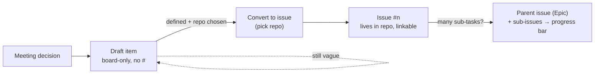
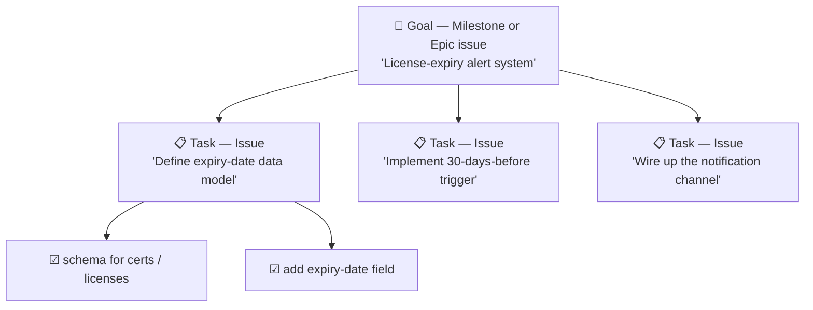
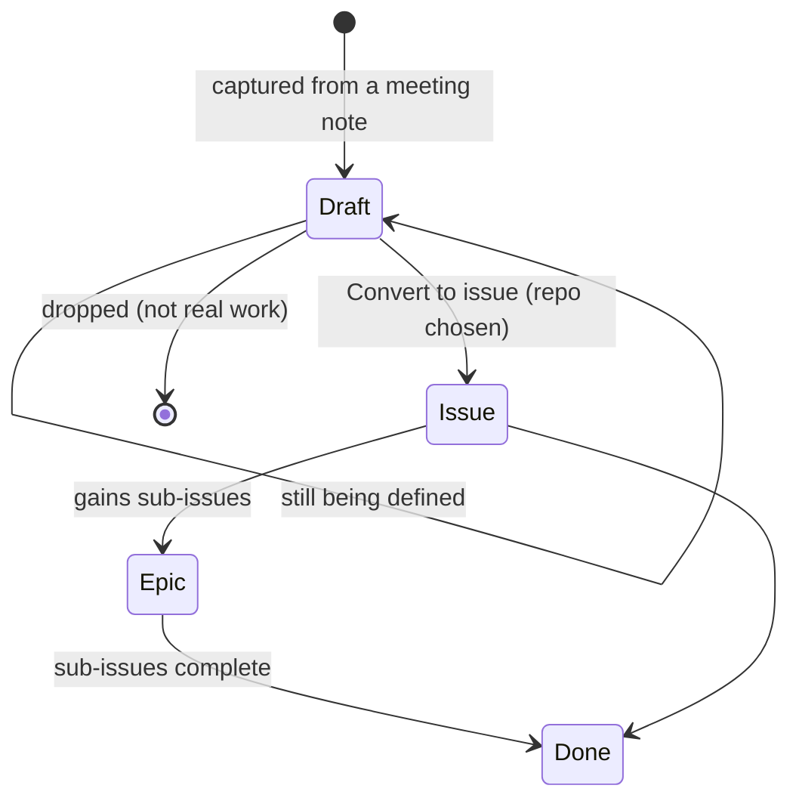

# Playbook — How we model work on GitHub Projects

> Audience: anyone (human or agent) adding or grooming work on the
> [KIBA Automation board](https://github.com/orgs/KIBA-Automation/projects/1).
> This is the *modeling* companion to [`../README.md`](../README.md) (the reconcile
> loop) and [`migration.md`](migration.md) (why we left Plane). It records the
> conventions we settled on while learning GitHub Projects as a team.

GitHub Projects is deliberately thinner than a Jira/Plane. It gives you a small set
of primitives and expects *you* to impose the structure. This page is that structure.

---

## 1. What an "item" is

Every row on the board is an **item**, and an item is exactly one of three things:

| Item type | Lives in | Has `#number` | Comments | Links to code | Use it for |
|-----------|----------|:-------------:|:--------:|:-------------:|------------|
| **Draft** | the Project only | no | no | no | a quick capture whose home repo / definition isn't settled yet |
| **Issue** | a repository | yes | yes | yes | real, started work that belongs to a known repo |
| **Pull request** | a repository | yes | yes | yes | (created by the dev workflow, not by us) |

The rule of thumb: **capture as a draft, promote to an issue when the work is defined
and has a repo home.** Promotion is GitHub's *Convert to issue* action — it cannot be
undone into a draft, and it *requires* choosing a target repository (that choice is
the link to the code).

---

## 2. The three altitudes

The mistake we kept making was writing one title that tried to be both the *goal* and
the *checklist*. GitHub has a distinct tool for each altitude — pick the tool, then
the title writes itself.

| Altitude | Question it answers | GitHub tool | Example (quali-fit) |
|----------|---------------------|-------------|---------------------|
| **Goal** | "what are we ultimately delivering?" | **Milestone** *or* an **Epic** (parent issue) | License-expiry alert system |
| **Task** ← *the issue title lives here* | "what concrete piece is done or not?" | **Issue** | Implement the 30-days-before alert trigger |
| **Checklist** | "what steps make up this task?" | **Sub-issue** *or* a `- [ ]` task list in the body | Define the expiry-date schema |

**The "done test"** for picking the issue-title altitude: *can you clearly answer
"is this done — yes or no?"*
- Too high — "Build the recommendation system" → never cleanly done → that's a **Milestone**.
- Too low — "Add a weight param to `score()`" → a single checkbox → that's a **task-list line**.
- Just right — "Implement the certificate matching score" → clear start and finish.

### Goal: Milestone vs Epic — which?
- **Milestone** — a repo-level bucket with a *due date*. Best for "everything we ship
  by date X". It is **not** a board card; you group/filter the board by it.
- **Epic (parent issue)** — an actual issue that owns **sub-issues**. It **is** a board
  card and GitHub auto-computes a `Sub-issues progress` bar (`3/5`). Best when the goal
  itself needs a description, an owner, and visible roll-up. The two compose: an Epic
  can also be assigned to a Milestone.

For KIBA's capability-shaped goals ("…automation system"), **Epic issues** fit better
than Milestones — they stay visible as cards, exactly as the original drafts were.

---

## 3. Naming convention

GitHub does **not** use project-key prefixes (`AP-6`) — once an item is an issue, its
`#number` is the identity, so a prefix just duplicates it.

- **Title = `verb + object`**, descriptive, no key prefix. The reader should get it in
  five words.
- Put categorization in **metadata, not the title**: Label (kind/area), Repository
  (which codebase), Milestone (when), and the custom **Priority** field.
- If a legacy key carries meaning worth keeping, move it to a **Label** (e.g. `AP-6`),
  not the title.

| ❌ Plane/Jira style | ✅ GitHub style |
|--------------------|-----------------|
| `AP-6 회사 등록증 및 허가증 유효기간 만료 알림 시스템` | Milestone/Epic `License-expiry alert system` + Issue `Implement the 30-days-before alert trigger` |

---

## 4. Fields on this board

| Field | Kind | Notes |
|-------|------|-------|
| **Status** | built-in single-select | Shipped with `Todo / In Progress / Done`; we **extended** the options to `Backlog / Todo / In Progress / Done / Cancelled` (mirrors the old Plane states). The human moves items to *In Progress* — the agent never auto-starts. |
| **Priority** | custom single-select | `High / Medium / Low`. GitHub has no native priority; we added this. Use it as a focus lens — group/filter a saved view by it. |
| `Parent issue`, `Sub-issues progress` | built-in | Enable the Epic ↔ sub-issue roll-up in §2. |
| `Repository`, `Labels`, `Milestone`, `Assignees` | built-in | Empty on drafts; populate once an item is converted to an issue. |

---

## 5. Lifecycle at a glance

Every transition that **writes to the board** goes through the human-in-the-loop gate
defined in [`../CLAUDE.md`](../CLAUDE.md): propose → confirm → apply → report.

---

## 6. Open decisions (living)

These are genuinely undecided — listed so they don't masquerade as settled:

- **Repo homes for the `AP-1 … AP-8` drafts.** Only `AP-6 → quali-fit` is decided so
  far. The automation-flavoured drafts (`AP-3` crawl, `AP-4` sheet sync, `AP-5` email
  intake, `AP-7` travel-cost) have **no repo yet**, so they correctly stay as drafts
  until one exists.
- **Whether to back-fill a `Type` label** (e.g. `automation`, `data`, `product`) for
  cross-repo filtering.
- **Milestones** — not yet created; introduce the first one when a dated bundle of
  Epics actually forms.
